# anomaly-detection-PaDiM

## Results
* Image-level anomaly detection accuracy (ROCAUC)

|Category|R18-Rd100|WR50-Rd550|RN101-Rd550|Eb7|
|:---:|:---:|:---:|:---:|:---:|
|Carpet|0.97| | | |
|Grid|0.90| | | |
|Leather|1.00| | | |
|Tile|0.94| | | |
|Wood|0.99| | | |
|All texture classes|0.96| | | |
|Bottle|1.00| | | |
|Cable|0.86| | | |
|Capsule|0.87| | | |
|Hazelnut|0.85| | | |
|Metal nut|0.98| | | |
|Pill|0.89| | | |
|Screw|0.75| | | |
|Toothbrush|0.96| | | |
|Transistor|0.92| | | |
|Zipper|0.89| | | |
|All object classes|0.90| | | |
|All classes|0.92| | | |

* Pixel-level anomaly detection accuracy (ROCAUC)

|Category|R18-Rd100|WR50-Rd550|RN101-Rd550|Eb7|
|:---:|:---:|:---:|:---:|:---:|
|Carpet|0.97| | | |
|Grid|0.90| | | |
|Leather|1.00| | | |
|Tile|0.94| | | |
|Wood|0.99| | | |
|All texture classes|0.96| | | |
|Bottle|1.00| | | |
|Cable|0.86| | | |
|Capsule|0.87| | | |
|Hazelnut|0.85| | | |
|Metal nut|0.98| | | |
|Pill|0.89| | | |
|Screw|0.75| | | |
|Toothbrush|0.96| | | |
|Transistor|0.92| | | |
|Zipper|0.89| | | |
|All object classes|0.90| | | |
|All classes|0.92| | | |

* Per-region-overlap detection accuracy (PROAUC)

|Category|R18-Rd100|WR50-Rd550|RN101-Rd550|Eb7|
|:---:|:---:|:---:|:---:|:---:|
|Carpet|0.97| | | |
|Grid|0.90| | | |
|Leather|1.00| | | |
|Tile|0.94| | | |
|Wood|0.99| | | |
|All texture classes|0.96| | | |
|Bottle|1.00| | | |
|Cable|0.86| | | |
|Capsule|0.87| | | |
|Hazelnut|0.85| | | |
|Metal nut|0.98| | | |
|Pill|0.89| | | |
|Screw|0.75| | | |
|Toothbrush|0.96| | | |
|Transistor|0.92| | | |
|Zipper|0.89| | | |
|All object classes|0.90| | | |
|All classes|0.92| | | |

* Precision-recall detection accuracy (PRAUC)

|Category|R18-Rd100|WR50-Rd550|RN101-Rd550|Eb7|
|:---:|:---:|:---:|:---:|:---:|
|Carpet|0.97| | | |
|Grid|0.90| | | |
|Leather|1.00| | | |
|Tile|0.94| | | |
|Wood|0.99| | | |
|All texture classes|0.96| | | |
|Bottle|1.00| | | |
|Cable|0.86| | | |
|Capsule|0.87| | | |
|Hazelnut|0.85| | | |
|Metal nut|0.98| | | |
|Pill|0.89| | | |
|Screw|0.75| | | |
|Toothbrush|0.96| | | |
|Transistor|0.92| | | |
|Zipper|0.89| | | |
|All object classes|0.90| | | |
|All classes|0.92| | | |
 ### ROC Curve

* ResNet18-Rd100

    

### Localization examples

    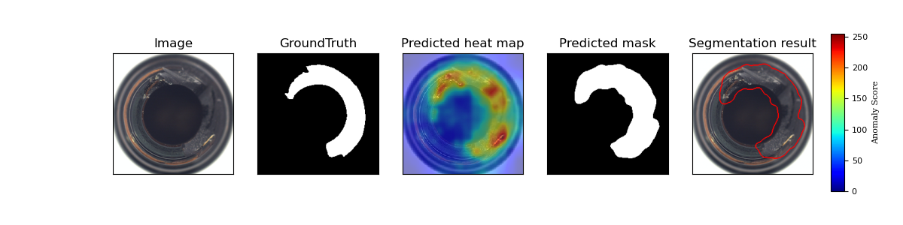

    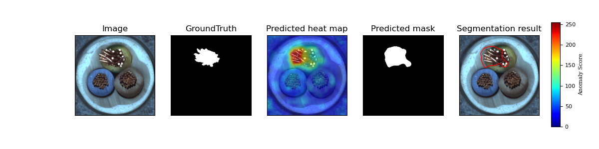

    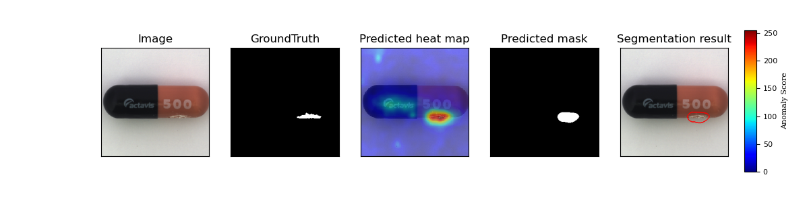

    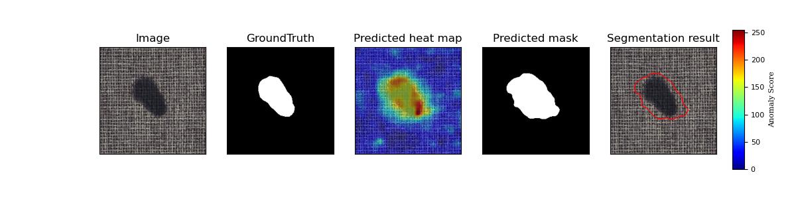

    

    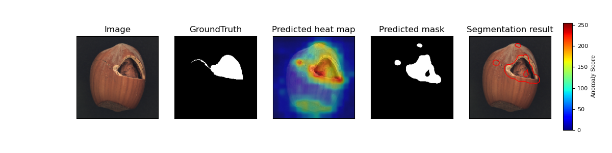

    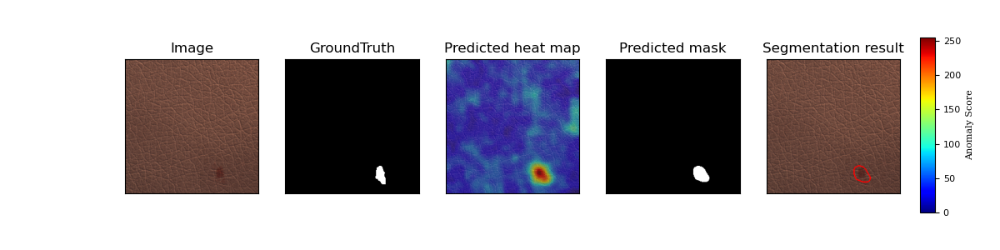

    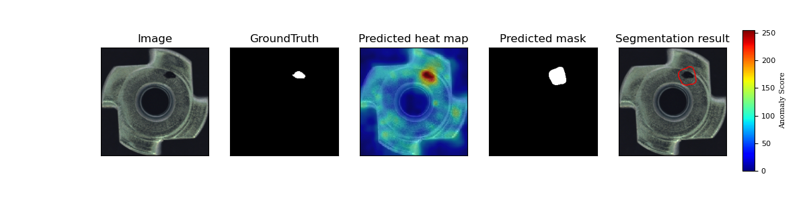

    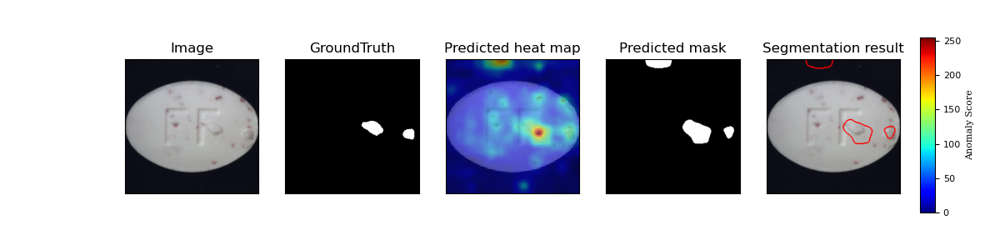

    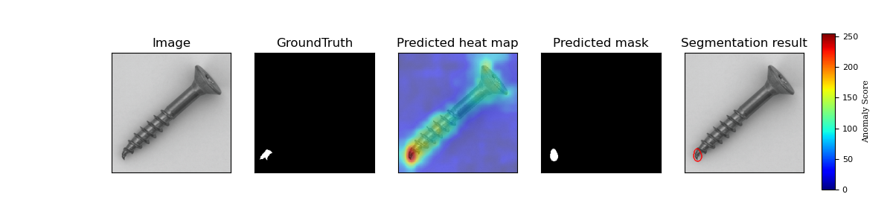

    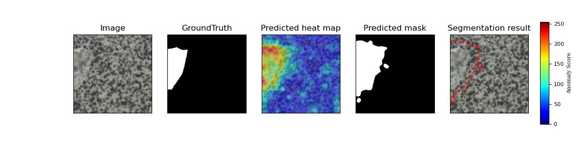

    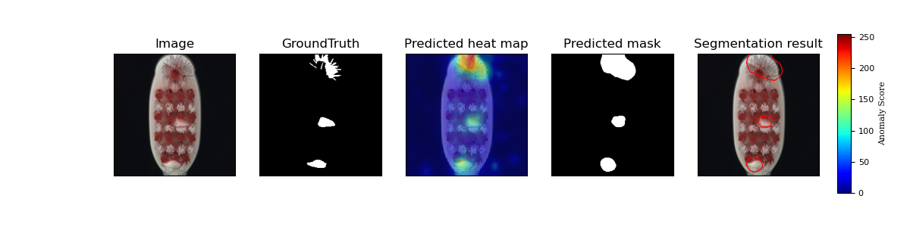

    

    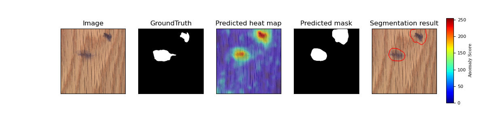

    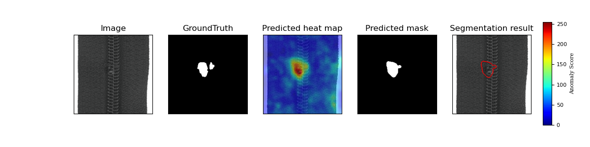

